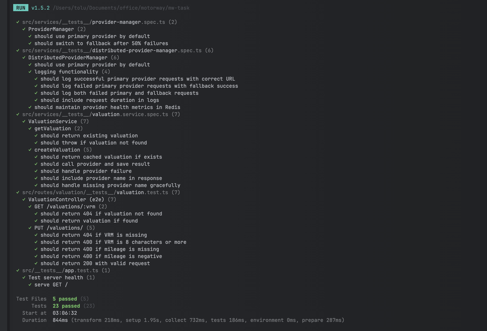

# Description

The Motorway backend take home code test. Please read the description and the brief carefully before starting the test.

**There's no time limit so please take as long as you wish to complete the test, and to add/refactor as much as you think is needed to solve the brief. However, we recommend around 60 - 120 minutes as a general guide, if you run out of time, then don't worry.**

**For anything that you did not get time to implement _or_ that you would like to change/add but you didn't feel was part of the brief, please feel free to make a note of it at the bottom of this README.md file**

## Installation

```bash
$ npm install
```

## Running the app

```bash
# development (local)
$ npm run dev

# production mode (deployed)
$ npm run start
```

## Test

```bash
# run all tests
$ npm run test

# test coverage
$ npm run test:coverage
```

## Current Solution

This API is a simple but important API for motorway that is responsible for retrieving valuations for cars from a 3rd party (SuperCar Valuations) by the VRM (Vehicle Registration Mark) and mileage.

- The API has two routes
	- A PUT (/valuations/{vrm}) request to create a valuation for a vehicle which accepts a small amount of input data and performs some simple validation logic.
	- A GET (/valuations/{vrm}) request to get an existing valuation. Returns 404 if no valuation for the vrm exists.

- The PUT operation handles calling a third-party API to perform the actual valuation, there is some rudimentary mapping logic between Motorway & 3rd party requests/responses.
- The PUT request is not truly idempotent so the 3rd party is called each time this operation is called and the code catches duplicate key exceptions when writing to the database.
- If the 3rd party is unreachable or returns a 5xx error, the service returns a 500 Internal Server Error.
- The outcome is stored in a database for future retrieval in the GET request.
- All the logic for the entire operation is within a single method in a single "service" class.
- A QA engineer has added some high-level tests.
- The tests for validation failures all pass.
- A simple happy path test is currently failing as the I/O calls for the database and 3rd party have not been isolated and the clients are trying to hit real resources with an invalid configuration.

## Task Brief

As this is such an important service to Motorway, a decision has been made to add a fallback 3rd party provider called Premium Car Valuations in case SuperCar Valuations is unavailable for a period of time. Before we add any more features, we need to fix the broken test.

Here are a full list of tasks that need to be completed:

**Tests**

- Modify the code/test so that the existing test suite passes and no I/O calls are made during the execution of the test suite.

- Add a test for the GET call.

- All new functionality should have test coverage in a new or updated existing test.

**Features**

- Introduce a basic failover mechanism to call the fallback 3rd party provider (Premium Car Valuations) in the event that the failure rate of the calls to SuperCar Valuations exceeds 50%. To keep the test simple, assume this service is running as a single instance. Feel free to discuss how you might solve it differently if the service was to execute in a multi-node cluster. Be mindful that this is a popular API, therefore the solution needs to be able to handle tracking the success rate of a large number of requests.

- As Premium Car Valuations is more expensive to use, there is a need to revert back to SuperCar Valuations after a configurable amount of time. At this point, the failure rate to indicate failover should be reset.

- If both providers are unreachable or return a 5xx error, then the service should now return a 503 Service Unavailable Error.

- To save costs by avoiding calling either 3rd party, improve the PUT operation so that the providers are not called if a valuation has already occurred. NOTE: This is to save costs, not for any consistency concerns between Motorway and the 3rd party. (Don't worry about concurrency, if two requests for the same route occur at the same time, either response can be saved).

- To help increase customer confidence regarding the valuation Motorway shows the user, there is a new requirement to show the name of the provider who provided the valuation to the user on the front end, e.g. "Valued by Trusted Company {X}", therefore the name of the provider that was used for the valuation needs to be persisted in the database and returned in the response.

- The service should be tolerant to older records where there is no detail of the provider (Backwards Compatible).

- Refactor the code as you see fit to ensure it is more readable, maintainable and extensible.

- To help with auditing service level agreements with the providers over an indefinite time period, there is a need to store the following details of the request:

    - Request date and time
    - Request duration
    - Request url
    - Response code
    - Error code/message if applicable and the
    - Name of the provider

    The details must be stored in a ProviderLogs table, which is correlated to a VRM, there could potentially be more than one log per VRM.


## 3rd Party APIs

For the purposes of this code test, simple mocks have been created use a service called [Mocky](https://designer.mocky.io/) with simple canned responses. Assume, that these would be real RESTful/SOAP services.

## 3rd Party OpenAPI Specs

Details of the existing 3rd party (SuperCar Valuations) and the new provider (Premium Car Valuations) can be found below.

To view the OpenAPI specifications for the 3rd Party APIs at the links below, first run the `npm run third-party-api:serve-docs` command.

### SuperCar Valuations

This is the current and preferred provider used for valuations, it is a fairly modern and cost-effective API.

The OpenAPI Specification can be found [here](http://localhost:3001/docs).

The URI for this test stub in Mocky is https://run.mocky.io/v3/9245229e-5c57-44e1-964b-36c7fb29168b.

### Premium Car Valuations

This is the proposed fallback provider to be used for valuations, it is an old service and costs significantly more for each call.

The OpenAPI Specification can be found [here](http://localhost:3002/docs).

The URI for this test stub in Mocky is https://run.mocky.io/v3/0dfda26a-3a5a-43e5-b68c-51f148eda473.


# Candidate Notes
Here is a place for you to put any notes regarding the changes you made and the reasoning and what further changes you wish to suggest.



---

## **Implementations**

1. **API Layer**
    - The system exposes a FastifyJS-based REST API with two primary endpoints:
        - `GET /valuations/:vrm` - Retrieves existing valuations for a given vehicle.
        - `PUT /valuations/:vrm` - Creates/updates valuations, including mileage data for a vehicle.
    - Input validation is enforced using JSON schema to ensure correct data formats.

2. **Service Layer**
    - **ValuationService**: Orchestrates valuation operations, including interfacing with providers and managing the caching layer.
    - **DistributedProviderManager**: Manages failover mechanisms between valuation providers to ensure resilience in case of failure.
    - Data is persisted using TypeORM, with entities like `VehicleValuation` and `ProviderLog` to track vehicle valuations and provider interactions.

3. **Provider System**
    - **Dual Provider Setup**:
        - **SuperCarValuationsProvider**: Primary provider, returning data in JSON format.
        - **PremiumValuationsProvider**: Fallback provider, returning data in XML format.
    - A provider interface ensures that both providers implement common methods (`getValuation()` and `getRequestUrl()`).
    - Each provider has a dedicated transformer to handle its respective response format.

---

## **Recent Improvements**

### **Reliability**
- Implemented a **failover mechanism** to ensure continuous service, with a 50% failure threshold and automatic fallback after a 15-minute reset interval.
- Introduced a **sliding window** mechanism to track provider health and manage failures dynamically.
- **Automatic fallback recovery** ensures the system returns to normal operation after health resets.

### **Performance**
- **Caching Layer** added in `ValuationService` to minimize repeated provider calls and speed up response times by returning previously cached valuations.
- Optimized provider calls by leveraging cached data and implementing **request deduplication** to avoid unnecessary duplicate requests.

### **Monitoring & Logging**
- A comprehensive **provider logging system** captures detailed request timing, duration, response codes, and error messages.
- Logs are correlated by VRM for audit purposes and to facilitate troubleshooting.
- **Error tracking** and correlation mechanisms help identify and resolve provider issues more efficiently.

---

## **Future Improvements**

### **Performance Optimizations**
- Implement **request batching** for handling multiple valuation requests in a single operation, improving throughput and reducing overhead.
- **Rate limiting per provider** to prevent overwhelming the providers and ensure fair usage.

### **Monitoring & Observability**
- **Metrics collection** for monitoring provider performance, response times, and error rates.
- Implement **real-time dashboards** to visualize provider health, requests, and failures.
- Set up **alerting** for sustained provider failures to proactively address issues.

### **Security Enhancements**
- Implement **API key ** for providers to enhance security and prevent unauthorized access.
- Implement **rate limiting per client** to prevent misuse and ensure fair usage of the service.

### **Code Quality & Maintainability**
- Add **OpenAPI/Swagger documentation** for improved API discoverability and easier integration.
- Use **dependency injection** to improve modularity and testability of the system.

### **Provider Registration & Configuration with Fallback Mechanism**
- Implement fallback based on priority, as there may be more than one fallback provider.
- Create a better way to register multiple providers and disable some by default from the configuration using an active boolean.

```typescript

export interface Provider {
  name: string;
  getValuation(request: ValuationRequest): Promise<ValuationResponse>;
  getRequestUrl(vrm: string, mileage: number): string;
}

export interface ProviderConfig {
  name: string;
  priority: number;
  active: boolean;
  provider: Provider;
}

```
---


## **Key Takeaways**
These improvements aim to significantly enhance the **reliability, maintainability**, and **performance** of the system, ensuring it can scale efficiently in production environments. Implementing these changes will also contribute to better **monitoring**, **security**, and **observability**, making the system more robust and ready for a variety of operational challenges.


